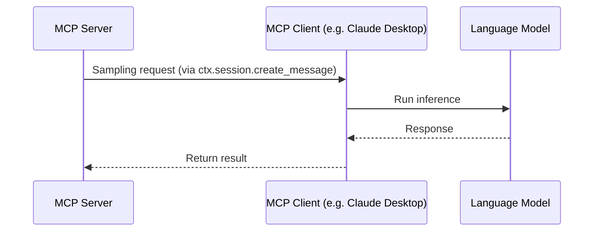
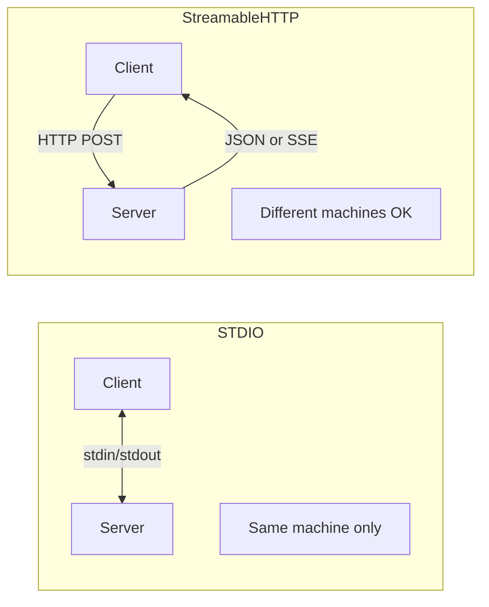
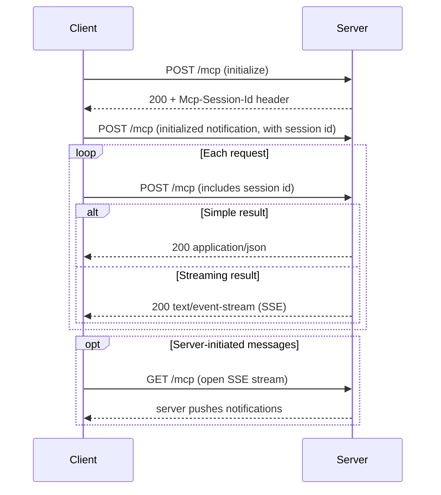

I recently went through Anthropic's MCP course on the features that aren't obvious from the basic docs. Here's what I learned.

> A note on packages before we start: all the code below uses the **official `mcp` package** and its bundled `FastMCP` (from mcp.server.fastmcp import FastMCP). There's also a separate **`fastmcp`** package (v2,from fastmcp import FastMCP) with a bit different API.

## Sampling

Normally, if you build an MCP server that needs to call an LLM, you'd have to manage API keys and pay for those calls yourself.

With sampling, the **server asks the client to run the LLM** instead:



1. First, the server requests sampling 
2. The client receives the request
3. The client runs the LLM using its own credentials
4. The client returns the result back to the server

So you get LLM capabilities without ever touching API keys or paying inference costs. The client handles all of that.

On the server when you make a tool call, run the `create_message()z method, passing in some messages that you wish to send to a language model.

```python
from mcp.server.fastmcp import FastMCP, Context
from mcp.types import SamplingMessage, TextContent

mcp = FastMCP(name="Demo Server")


@mcp.tool()
async def summarize(text_to_summarize: str, ctx: Context):
    prompt = f"""
        Please summarize the following text:
        {text_to_summarize}
    """

    result = await ctx.session.create_message(
        messages=[
            SamplingMessage(
                role="user", content=TextContent(type="text", text=prompt)
            )
        ],
        max_tokens=4000,
        system_prompt="You are a helpful research assistant.",
    )

    if result.content.type == "text":
        return result.content.text
    else:
        raise ValueError("Sampling failed")


if __name__ == "__main__":
    mcp.run(transport="stdio")
```

The part that actually runs the LLM lives on the **client**, registered as a callback on the session:

```python
from mcp import ClientSession, types

async def handle_sampling(
    context,
    params: types.CreateMessageRequestParams,
) -> types.CreateMessageResult:
    # The client runs the LLM with its own credentials here.
    return types.CreateMessageResult(
        role="assistant",
        content=types.TextContent(type="text", text="...result from client LLM..."),
        model="claude-sonnet-...",
        stop_reason="endTurn",
    )

# Pass it when constructing the client session:
# session = ClientSession(read, write, sampling_callback=handle_sampling)
```

(One version note: the `sampling_callback` signature changed from a single-argument `(message)` form in older releases to the `(context, params)` form shown here. Check what your installed version expects.)

## Log and Progress Notifications

Tools can emit two types of notifications during execution: **logs** and **progress updates**.

In FastMCP, both work through the `Context` argument that's automatically injected into your tool function when you type-hint a parameter as `Context`. This context object gives you methods to communicate back to the client during execution. The server emits these events, and the client receives them via its registered handlers.

```python
from mcp.server.fastmcp import Context, FastMCP
from mcp.server.session import ServerSession

mcp = FastMCP(name="my-server")

@mcp.tool()
async def process_files(files: list[str], ctx: Context[ServerSession, None]) -> str:
    """Process files, streaming progress and logs to the client."""
    for i, file in enumerate(files):
        # Progress notification — client shows a progress bar
        await ctx.report_progress(progress=i, total=len(files))

        # Log notification — client receives it as a log message
        await ctx.info(f"Processing {file}...")

        # ... do work ...

    return f"Processed {len(files)} files"
```

Note that `ctx.info()` and `ctx.report_progress()` are used within an async function. This is useful for long-running tools - instead of a silent wait, you can stream progress updates back to the user in real time.

## Roots

Roots scope which files and folders on the user's machine an MCP server is allowed to work within.

The **client** declares the roots and the **server** asks for them. Rather than giving a server full filesystem access, the client tells the server "you're allowed to work here," and the server queries that list and respects it.

The server side - ask the client which roots it was granted:

```python
from mcp.server.fastmcp import Context, FastMCP
from mcp.server.session import ServerSession

mcp = FastMCP(name="my-server")

@mcp.tool()
async def analyze_project(ctx: Context[ServerSession, None]) -> str:
    """Work within the roots the client has exposed."""
    result = await ctx.session.list_roots()
    if not result.roots:
        return "No roots provided by the client."
    for root in result.roots:
        ...  # root.uri is a file:// URI the client allowed
    return f"Analyzed {len(result.roots)} root(s)."
```

The client side - declare the roots and answer `roots/list` requests:

```python
from pathlib import Path
from pydantic import FileUrl
from mcp import ClientSession, types

async def list_roots(context) -> types.ListRootsResult:
    cwd = Path.cwd().resolve()
    return types.ListRootsResult(
        roots=[types.Root(uri=FileUrl(f"file://{cwd}"), name=cwd.name)]
    )

# Pass it when constructing the client session:
# session = ClientSession(read, write, list_roots_callback=list_roots)
```

> Remember: the MCP SDK does not attempt to limit what files or folders your tools attempt to read! You must implement that check yourself. Consider implementing a function like `is_path_allowed`, which will decide whether a path is accessible by comparing it to the list of roots.

```python
async def is_path_allowed(requested_path: Path, ctx: Context) -> bool:
    roots_result = await ctx.session.list_roots()
    client_roots = roots_result.roots

    if not requested_path.exists():
        return False

    if requested_path.is_file():
        requested_path = requested_path.parent

    for root in client_roots:
        root_path = file_url_to_path(root.uri)
        try:
            requested_path.relative_to(root_path)
            return True
        except ValueError:
            continue

    return False
```

## Transport Protocols

All communication between MCP client and server is JSON-RPC. That's the underlying format regardless of which transport you use.

The transport layer is what differs. Two main options:



With FastMCP you don't hand-build a transport — you pick one when you run the server:

```python
from mcp.server.fastmcp import FastMCP

mcp = FastMCP(name="my-server")

# ... define tools, resources, etc. ...

if __name__ == "__main__":
    mcp.run()                               # STDIO (default)
    # mcp.run(transport="streamable-http")  # remote, single endpoint
```

### STDIO

The simpler one. Client and server communicate over standard input/output.

```python
from mcp.server.fastmcp import FastMCP

mcp = FastMCP(name="my-server")

# ... define tools ...

if __name__ == "__main__":
    mcp.run()  # transport="stdio" is the default
```

The big limitation: **client and server must run on the same machine**. Otherwise, it won't work.

### StreamableHTTP

With this transport, client and server can live on completely separate machines.

The key thing to understand: Streamable HTTP uses a **single endpoint** (e.g. `/mcp`). The client POSTs a request to it, and the server either returns plain JSON or upgrades *that same response* into an SSE stream when it has more to send. A `GET` on the endpoint is only used to open a standalone stream for server-initiated messages. (This is different from the older, now-deprecated HTTP+SSE transport, which split traffic across separate `/sse` and `/messages` endpoints — if you see that pattern in older guides, it's not Streamable HTTP.)

The connection flow:



Running it is one line; mounting it into an ASGI app (Starlette/FastAPI) is one more:

```python
from mcp.server.fastmcp import FastMCP

mcp = FastMCP(name="my-server")

# ... define tools ...

if __name__ == "__main__":
    mcp.run(transport="streamable-http")

# Or expose it as an ASGI app to mount inside Starlette / FastAPI:
app = mcp.streamable_http_app()
```

### A real example

Here's a small MCP I actually shipped that only works because of this transport.

[ZeroBounce](https://www.zerobounce.net/) (an email validation service) ships an official MCP server, but it's **stdio-only** and takes the API key as a **CLI argument**. So it runs on exactly one machine, and the key sits right there in `argv`. Fine for me on my laptop, useless for a team.

So I rebuilt it over StreamableHTTP: [scare-destiny/zero-bounce-mcp](https://github.com/scare-destiny/zero-bounce-mcp). The same tools — `validate_email`, `validate_batch`, `get_credits`, and a few more — served at a single `/mcp` endpoint. Because it's a remote server, I can register it as a **custom connector in claude.ai** and the whole team connects to it. The ZeroBounce API key lives server-side and never travels to the client.

And once it's a remote, authenticated server, you get things that just aren't possible over stdio. I put an OAuth + consent gate in front of it, and every tool call is logged to a per-user audit table — who called what, when, with what errors (never the API key). That's the practical difference between the two transports: stdio is "just me, on this laptop," StreamableHTTP is "a service a team connects to."
