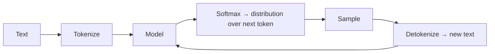
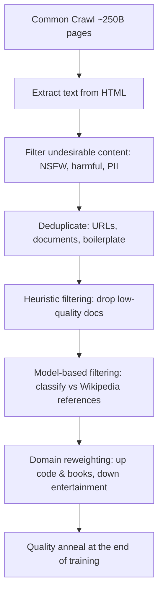
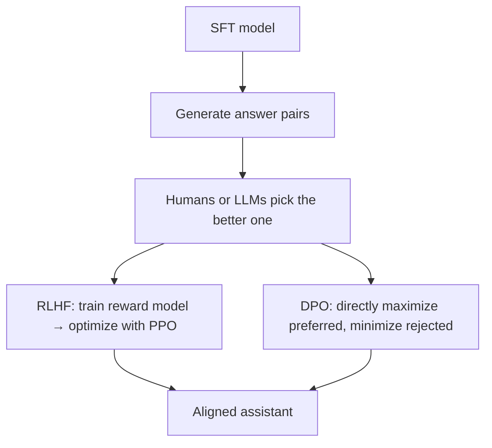

Training Llama 3 405B cost about $75 million. Almost none of the hard problems were about the neural network.

That's the claim that reframed how I think about these models. An LLM has five moving parts — **architecture, training loss, data, evaluation, and systems** — and academia pours its energy into the first two. Industry wins on the last three. The clever activation function almost never matters. The data pipeline, the evals, and the compute do.

My map here comes from Stanford CS229's [lecture on building large language models](https://www.youtube.com/watch?v=9vM4p9NN0Ts) by Yann Dubois — recorded in 2024, and still the best single walkthrough of the full pipeline I've found. Some numbers have moved since; the mechanics mostly haven't. Where the field genuinely changed after the lecture, I flag it with a **"since this lecture"** note.

The whole thing splits into two phases. **Pretraining** teaches a model to imitate the internet. **Post-training** turns that model into an assistant. GPT-3 was pretraining. ChatGPT was post-training. Same recipe underneath, wildly different product — and that gap is most of this post.

## Table of Contents
- [What "training an LLM" means](#what-training-an-llm-means)
- [The next-word game: tokenizers and perplexity](#the-next-word-game-tokenizers-and-perplexity)
- [Data is the actual work](#data-is-the-actual-work)
- [Scaling laws: predicting the future](#scaling-laws-predicting-the-future)
- [Post-training: from model to assistant](#post-training-from-model-to-assistant)
- [Systems: why compute is the bottleneck](#systems-why-compute-is-the-bottleneck)

## What "training an LLM" means

At its core, a language model is a probability distribution over sequences of words. "The mouse ate the cheese" gets a high score. "The cheese ate the mouse" gets a lower one — the model has picked up that cheese doesn't usually eat things. Once you have that distribution, you can *sample* from it. That's the entire sense in which these models are "generative."

The models everyone uses are **autoregressive**: they factor the probability of a sentence into the probability of each word given everything before it. That's not an approximation — it's the chain rule of probability. The practical consequence is that generation is a for-loop: predict a token, append it, predict the next.

I feel that for-loop every day. I run production voice agents, and token-by-token generation is exactly why latency is the whole game in voice AI — every word the agent speaks is another trip through the loop, and the caller is sitting in the silence.

That's all the architecture theory this post needs. I'm skipping transformer internals on purpose — there's endless material on them, and they're the part that matters least in practice.

## The next-word game: tokenizers and perplexity

Training is embarrassingly simple to state: **predict the next token**. Chop text into tokens, run them through the model, get a probability distribution over what comes next, and compare it against the token that actually came next with cross-entropy loss. Minimizing that loss is mathematically identical to maximizing the likelihood of the real text. The sampling and detokenizing steps below only exist at inference — during training you just nudge the weights toward the real token.

**Tokenizers** are the underrated piece. Why not whole words? Typos break you, and languages like Thai don't put spaces between words. Why not single characters? Sequences get absurdly long, and attention cost grows quadratically with length. So tokens land in between — roughly 3–4 letters each. The dominant algorithm, **Byte Pair Encoding**, starts with one token per character and repeatedly merges the most frequent adjacent pair until it hits a target vocabulary size.

This sounds like plumbing. It isn't. Numbers get chopped into arbitrary tokens, which is part of why models are shaky at arithmetic — they don't see digits the way we do. And one of GPT-4's quiet improvements was retokenizing code so that leading indentation spaces stopped confusing the model.

> **Since this lecture:** Dubois speculated we might eventually ditch tokenizers entirely. Meta's [Byte Latent Transformer](https://ai.meta.com/research/publications/byte-latent-transformer-patches-scale-better-than-tokens/) (December 2024) is exactly that bet — no tokens, just raw bytes grouped into dynamic patches, with more compute allocated where the data is harder to predict. Not mainstream yet, but the escape route from tokenizers is now a real research direction.

To track progress during training, the working metric is **perplexity** — the validation loss, exponentiated so it's readable. The intuition: perplexity is *how many tokens the model is hesitating between*. A perfect model would sit at 1. On the standard benchmark Dubois shows, perplexity fell from around 70 in 2017 to under 10 by 2023 — from hesitating between seventy words to fewer than ten.

> Perplexity is great while you develop one model, and useless for comparing across labs — it depends on the tokenizer. A model with a bigger vocabulary can look worse from that alone.

For cross-model comparison, people use aggregated benchmarks — **MMLU** (multiple-choice questions across dozens of domains), **HELM**, the Hugging Face leaderboard. These are messier than they look. The lecture's example: the *same* benchmark, scored two different ways, gave Llama-65B 63.7% on one harness and 48.8% on another. And train–test contamination means you often can't be sure the test set didn't leak into training.

## Data is the actual work

"We train on the clean internet" is doing an enormous amount of hiding. There is nothing clean about it.

You start by downloading the web. **Common Crawl** is the standard source — roughly 250 billion pages, about a petabyte. A random page from it is broken HTML with half-finished sentences, nothing like the Wikipedia article you're picturing. Turning that into training data is a pipeline, and every box below is its own hard problem:

Two of these are genuinely clever. The **model-based filter** trains a classifier to recognize pages that look like the ones Wikipedia links to — a cheap proxy for quality. And at the very end of training, you drop the learning rate and deliberately overfit on a small pile of high-quality data. Domain reweighting matters more than it sounds, too: more code in the mix reliably improves *reasoning*, not just coding.

By the time of the lecture, the frontier had reached about **15 trillion tokens** — both Llama 3 and the best academic datasets. On a Llama-sized team of ~70 people, Dubois estimates maybe 15 work on data alone. Labs keep the details secret for two reasons: competition, and copyright liability.

Data isn't a preprocessing step. It's the product.

> **Since this lecture:** the counts kept climbing — [Llama 4](https://ai.meta.com/blog/llama-4-multimodal-intelligence/) pretrained on 30T+ tokens, [Qwen3](https://arxiv.org/abs/2505.09388) on 36 trillion across 119 languages. The bigger shift: **synthetic data** went from research topic to standard practice. Qwen3's corpus includes math and code generated by its own predecessor models. The pipeline above didn't change — it grew a stage that writes its own training data.

## Scaling laws: predicting the future

Here's the result that still feels like magic. Plot loss against compute, data, or parameter count on a log-log scale, and you get a straight line. More data and bigger models predictably mean lower loss — and in this regime, where you have so much data you never repeat any of it, classical overfitting simply hasn't shown up. Nobody has a full theoretical account of why. Empirically, the lines just hold.

That predictability changes how you spend money. Say you get 10,000 GPUs for 30 days. The old way: train 30 full-size candidate models for a day each, ship the best — meaning your production model only ever trained for one day. The new way: spend ~3 days training *small* models at several sizes, fit a scaling law, extrapolate to pick the winning configuration, then train that one model for the remaining 27 days. You never tune the big model directly. You predict it.

The **Chinchilla** paper pinned down the training-optimal ratio: about **20 tokens per parameter**. Account for the cost of *serving* the model — inference, forever — and the calculus pushes toward ~150:1, because a smaller model is cheaper every single day it runs. That's the regime production models had moved to by the time of the lecture.

Which is Richard Sutton's **bitter lesson** in action: compute keeps getting cheaper, scaling laws keep holding, so what wins is whatever *soaks up compute* — not the clever tweak. Architectural cleverness mostly shifts the intercept of the line. Scale shifts everything.

Dubois's back-of-envelope for the biggest open model of that moment:

| Llama 3 405B | |
|---|---|
| Training tokens | 15.6 trillion (~40 per parameter) |
| Parameters | 405B |
| Hardware | 16,000 H100s |
| Wall-clock | ~70 days |
| All-in cost | ~$75M (compute + salaries) |
| CO₂ | ~4,000 tons — ≈2,000 JFK–London round trips |

Each model generation aims for roughly **10× the FLOPs** of the last. Hold that in your head the next time someone tells you their startup will "train their own model."

## Post-training: from model to assistant

A pretrained model is a document-completion engine. Ask GPT-3 to "explain the moon landing to a six-year-old" and it might reply with *more questions* — because on the internet, a question is often followed by another question, not an answer. Post-training fixes this. It's where ChatGPT was born.

**Supervised fine-tuning (SFT)** comes first: the same next-token loss, now on human-written question/answer pairs. The surprise is how little data it takes — the LIMA paper found scaling from 2,000 to 32,000 examples barely helped. The interpretation: SFT doesn't teach new knowledge. The pretrained model already contains every kind of internet author; SFT just tells it *which one to be*. A cranked-up learning rate is what lets a few thousand examples steer 15 trillion tokens' worth of weights.

But SFT is behavior cloning, and cloning has three problems. You're **bounded by human writing ability** — people judge answers better than they write them. You risk **teaching hallucination** — if a human answer cites a book the model never saw in pretraining, you're training it to produce plausible-sounding references it can't ground. And ideal answers are **expensive** to write.

**RLHF** flips it: instead of cloning behavior, maximize *preference*. Generate two answers, ask which is better, push the model toward the winner. The piece that made it work is the **reward model** — a classifier trained on those binary choices whose continuous score carries far more signal than a bare thumbs-up. Optimize against it with PPO and you get ChatGPT. In practice PPO is a mess — rollouts, clipping, endless knobs — so **DPO** (from Stanford) collapsed the whole thing into directly raising the probability of preferred answers and lowering rejected ones. Same optimum under reasonable assumptions, plain maximum likelihood, and by the time of the lecture it had become the open-source default.

> **Since this lecture:** the biggest shift in the whole field. Two weeks after this lecture was published, OpenAI shipped [o1](https://openai.com/index/introducing-openai-o1-preview/). Then [DeepSeek-R1](https://arxiv.org/abs/2501.12948) (January 2025) showed you can get o1-level reasoning with RL against *verifiable* rewards — did the math answer match, did the code pass its tests — no reward model, no human preference for the reasoning itself. Post-training stopped being a light alignment pass and became the main place capability gains come from.

Evaluating aligned models is its own headache. Perplexity breaks — after preference optimization the model is a *policy*, not a calibrated distribution, so likelihoods stop meaning anything. The alternatives are human preference at scale (**Chatbot Arena**) or an LLM judging pairs of answers (**AlpacaEval** — ~98% correlation with Arena rankings, under $10 a run). The trap is **length bias**: judges — human and LLM alike — prefer longer answers, and a model optimized against a biased judge inherits the bias. If ChatGPT over-explains at you, this is why.

This is the corner of the stack where I actually live. I don't pretrain models — but I built an eval harness for production voice agents that scores every call across eight quality dimensions, and the lecture's warning holds at every scale: your judge's biases become your product's biases unless you measure and correct for them.

## Systems: why compute is the bottleneck

None of the above matters if your GPUs sit idle — and by default, they do. GPUs are throughput machines built for one thing: fast matrix multiplication. But compute has improved faster than memory and communication, so the hard part is *feeding* the chips. The metric people watch is Model FLOP Utilization — observed throughput over theoretical peak — and **~50% is considered excellent**. Even frontier labs leave nearly half their silicon waiting on data.

Two tricks carry most of the weight. **Mixed precision**: store weights in 32-bit for stable updates, run the matrix multiplies in 16-bit — half the bits to move, and against SGD's noise the lost decimals don't matter. **Operator fusion**: every naive PyTorch line ships data from GPU memory to the cores and back again. Fuse the ops — send once, compute everything, return once — and you roughly double throughput. That's what `torch.compile` does.

That's the map. What surprised me most is how little of it is about the model — the architecture is the settled part, and the leverage sits in data and evaluation. It matches what I see in client work, at a scale about six orders of magnitude smaller: the wins never come from swapping to a cleverer model. They come from cleaning the data going in and building evals sharp enough to tell you whether you actually improved anything. The frontier labs learned that lesson at $75 million a run. You can learn it for free.
