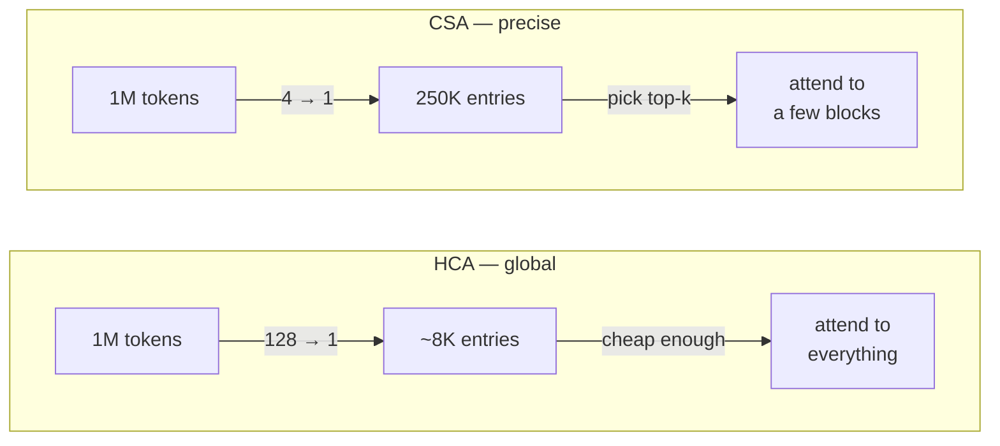

DeepSeek V4 Pro: **$0.04**. Kimi K3: $0.95. Claude Fable 5: **$2.75**.

DeepSeek is roughly **69x cheaper** than Fable.

Why? Because of hybrid attention mechanisms — CSA and HCA. This article explores how they work and what makes DeepSeek V4 so cheap.

## Table of Contents
- [Why attention matters](#why-attention-matters)
- [Three timescales of memory](#three-timescales-of-memory)
- [CSA: compress, then pick what matters](#csa-compress-then-pick-what-matters)
- [HCA: compress harder, look at everything](#hca-compress-harder-look-at-everything)
- [The receipts](#the-receipts)
- [Other reasons it's also cheap](#other-reasons-its-also-cheap)

## Why attention matters

When a transformer generates a token, it looks back at every previous token. Each of those previous tokens sits in memory as a key-value (KV) entry — the KV cache.

Two costs grow with context length:

1. **Memory.** A 1M-token conversation means a KV cache with a million entries, held in memory for every request.
2. **Compute.** Every new token loops over all of those entries at every step.

At short contexts this is fine. At a million tokens it's the main cost of inference.

DeepSeek's strategy: compress attention using two different techniques.

## Three timescales of memory

V4 gives the model three kinds of memory, each covering a different range at a different resolution:

Compression comes from two attention mechanisms: **CSA** and **HCA**. All V4 DeepSeek models have these two mechanisms interleaved with a 1:1 ratio, and both keep a 128-token sliding-window branch so the newest tokens aren't compressed.

## CSA: compress, then pick what matters

**Compressed Sparse Attention** is the mid-range memory, and it does two things.

**First, compression.** Every 4 consecutive tokens get merged into a single KV entry, using learned scores and softmax weights - the model learns *how* to summarize each group of four, rather than just averaging them. The cache shrinks 4x.

**Second, sparse retrieval.** Even a 4x-smaller cache is too big to attend over densely at 1M tokens. So a lightweight module called the **Lightning Indexer** scans the compressed entries, scores their relevance to the current query, and picks only the most relevant compressed blocks.

So CSA is compression *and* sparsity stacked: the memory is 4x smaller, and the model only touches the slice of it that matters right now.

## HCA: compress harder, look at everything

**Heavily Compressed Attention** makes the opposite trade. Instead of 4 tokens per entry, it packs **128 tokens into one** — a cache 32x lighter than CSA's.

At that size, DeepSeek doesn't bother with sparse selection. The compressed cache is small enough that the model attends densely over **all** of it — no indexer, nothing skipped.

The two mechanisms are complementary:

| | CSA | HCA |
|---|---|---|
| Compression | 4 → 1 | 128 → 1 |
| Attention | Sparse (top-k blocks) | Dense (everything) |
| Character | Precise, selective | cheap, global |
| Failure mode | Indexer misses a block | Detail lost in summary |

## The receipts

The paper's numbers, at 1M-token context versus DeepSeek's own V3.2:

- **V4-Pro: 27% of the inference FLOPs, 10% of the KV cache.**
- **V4-Flash: 10% of the FLOPs, 7% of the KV cache.**

There are smaller optimizations stacked on top — the KV cache is stored mostly in FP8, positional encoding only touches the last 64 dimensions, the indexer drops to FP4 at extreme lengths.

## Other reasons it's also cheap

Architecture isn't everything. DeepSeek also benefits from cheaper electricity, labor, chips and state backing.

---

*Sources: [DeepSeek-V4: Towards Highly Efficient Million-Token Context Intelligence](https://arxiv.org/abs/2606.19348) · [Sebastian Raschka's CSA/HCA architecture notes](https://sebastianraschka.com/llm-architecture-gallery/csa-hca/) · [Artificial Analysis: DeepSeek V4 Pro](https://artificialanalysis.ai/models/deepseek-v4-pro)*
