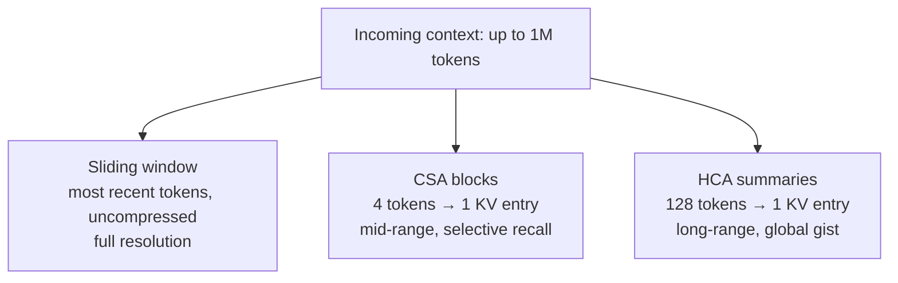
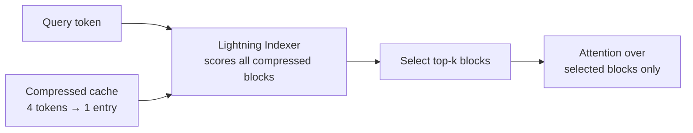

Same benchmark task. DeepSeek V4 Pro: **$0.04**. Kimi K3: $0.95. Claude Fable 5: **$2.75**.

Those are [Artificial Analysis numbers](https://artificialanalysis.ai/models/deepseek-v4-pro) — the weighted average cost to run one of their Intelligence Index tasks. Not cherry-picked token prices, actual end-to-end task cost. DeepSeek is roughly **69x cheaper** than the most expensive frontier model on that chart, while landing an Intelligence Index score of 44.

The easy explanations — cheaper electricity, cheaper chips, state support — are real, and I'll get to them. But they don't explain a 69x gap. The interesting part is architectural, and it's laid out in the open in the [DeepSeek-V4 paper](https://arxiv.org/abs/2606.19348).

When I wrote about [how LLMs get built](/posts/how-llms-are-built/), I skipped transformer internals on purpose — they're usually the part that matters least. This is the exception. This time the internals *are* the story.

## Table of Contents
- [The bet: long context, not benchmarks](#the-bet-long-context-not-benchmarks)
- [Why attention is the expensive part](#why-attention-is-the-expensive-part)
- [Three timescales of memory](#three-timescales-of-memory)
- [CSA: compress, then pick what matters](#csa-compress-then-pick-what-matters)
- [HCA: compress harder, look at everything](#hca-compress-harder-look-at-everything)
- [The receipts](#the-receipts)
- [The boring reasons it's also cheap](#the-boring-reasons-its-also-cheap)
- [What this changes](#what-this-changes)

## The bet: long context, not benchmarks

Most labs optimize for the leaderboard screenshot. DeepSeek's V4 release optimizes for something else: making **million-token context** economically survivable.

Both V4 variants — Pro (1.6T total parameters, 49B active) and Flash (284B total, 13B active) — support 1M-token contexts natively. That's the whole design goal, right in the paper's title: *"Towards Highly Efficient Million-Token Context Intelligence."*

And long context is exactly where standard transformers bleed money.

## Why attention is the expensive part

Quick refresher. When a transformer generates a token, it looks back at every previous token through attention. Each of those previous tokens sits in memory as a key-value (KV) entry — the KV cache.

Two costs grow with context length:

1. **Memory.** A 1M-token conversation means a KV cache with a million entries, held in GPU memory for every request.
2. **Compute.** Every new token attends over all of those entries, every step.

At short contexts this is fine. At a million tokens it's the dominant cost of inference. Every trick in V4 is aimed at one question: *how do you remember a million tokens without paying for a million tokens?*

DeepSeek's answer: stop storing history at full resolution. Compress it — at two different strengths — and keep only the recent past sharp.

## Three timescales of memory

V4 gives the model three kinds of memory, each covering a different range at a different resolution:

Which is roughly how human memory works. You remember the last sentence you read word for word. The last page as compressed chunks of meaning. The last book as a handful of summaries. Nobody keeps a verbatim transcript of everything — that would be absurdly expensive. That's the exact same insight, applied to a KV cache.

The two compressed tiers come from two new attention mechanisms: **CSA** and **HCA**. V4 alternates between them across layers, and both keep a supplementary sliding-window branch so the newest tokens are always available at full resolution — you never want the words the model *just* wrote summarized away mid-sentence.

## CSA: compress, then pick what matters

**Compressed Sparse Attention** is the mid-range memory, and it does two things.

**First, compression.** Every 4 consecutive tokens get merged into a single KV entry, using learned scores and softmax weights — the model learns *how* to summarize each group of four, rather than just averaging them. The cache shrinks 4x.

**Second, sparse retrieval.** Even a 4x-smaller cache is too big to attend over densely at 1M tokens. So a lightweight module called the **Lightning Indexer** scans the compressed entries and scores their relevance to the current query — cheaply, using low-rank projections instead of full attention. Only the top-k highest-scoring blocks get real attention. Everything else is skipped.

So CSA is compression *and* sparsity stacked: the memory is 4x smaller, and the model only touches the slice of it that matters right now. Precise recall, without paying for full resolution or full coverage.

## HCA: compress harder, look at everything

**Heavily Compressed Attention** makes the opposite trade. Instead of 4 tokens per entry, it packs **128 tokens into one** — a cache 32x lighter than CSA's.

At that size, DeepSeek doesn't bother with sparse selection. The compressed cache is small enough that the model attends **densely over all of it**, every step. No indexer, no top-k, no risk of the retrieval step missing something — just a full, cheap pass over a heavily summarized history.

The two mechanisms are complementary:

| | CSA | HCA |
|---|---|---|
| Compression | 4 → 1 | 128 → 1 |
| Attention | Sparse (top-k blocks) | Dense (everything) |
| Character | Precise, selective | Coarse, global |
| Failure mode | Indexer misses a block | Detail lost in summary |

CSA can retrieve a specific fact from 400K tokens ago — *if* the indexer surfaces it. HCA guarantees nothing is entirely invisible — at low resolution. Alternate the two across layers and each covers the other's blind spot.

## The receipts

The paper's numbers, at 1M-token context versus DeepSeek's own V3.2:

- **V4-Pro: 27% of the inference FLOPs, 10% of the KV cache.**
- **V4-Flash: 10% of the FLOPs, 7% of the KV cache.**

There's a stack of smaller tricks compounding on top — the KV cache is stored mostly in FP8, positional encoding only touches the last 64 dimensions, the indexer drops to FP4 at extreme lengths. Each one shaves another slice off memory and compute.

Cheaper inference per token, and dramatically cheaper inference at long context — which is where agentic workloads actually live. That's how you end up at [$0.04 per benchmark task](https://artificialanalysis.ai/models/deepseek-v4-pro). For reference, the list price is [$0.435 per million input tokens](https://artificialanalysis.ai/articles/deepseek-is-back-among-the-leading-open-weights-models-with-v4-pro-and-v4-flash) — a fraction of what any Western frontier lab charges.

## The boring reasons it's also cheap

Honesty section: architecture isn't the whole gap. DeepSeek also benefits from cheaper electricity, cheaper engineering labor, domestic chip supply, and state backing — and, as an open-weights release, from pricing pressure it deliberately creates. Some slice of that 69x is economics, not attention math.

But the architectural part is public, replicable, and peer-visible. Anyone can read the paper and check the FLOPs claims. That's the part worth understanding.

## What this changes

I pay for tokens every day — agentic coding runs that chew through hundreds of thousands of tokens before lunch. The bill is real enough that I think about context the way I used to think about cloud costs: cache aggressively, trim histories, summarize old turns.

The V4 design points at a future where most of that discipline becomes unnecessary. If a million tokens of context costs cents instead of dollars, "just put the entire codebase in context" stops being a luxury and becomes the default. Whole categories of RAG plumbing exist only because context is expensive. Attention architectures like this are how that assumption dies.

The frontier labs will keep winning on raw capability for a while. But the cost curve has its own gravity. When one lab shows you can serve million-token contexts at 10% of the memory, the question isn't whether the others adopt these ideas. It's how fast.

---

*Sources: [DeepSeek-V4: Towards Highly Efficient Million-Token Context Intelligence](https://arxiv.org/abs/2606.19348) · [Sebastian Raschka's CSA/HCA architecture notes](https://sebastianraschka.com/llm-architecture-gallery/csa-hca/) · [Artificial Analysis: DeepSeek V4 Pro](https://artificialanalysis.ai/models/deepseek-v4-pro)*
