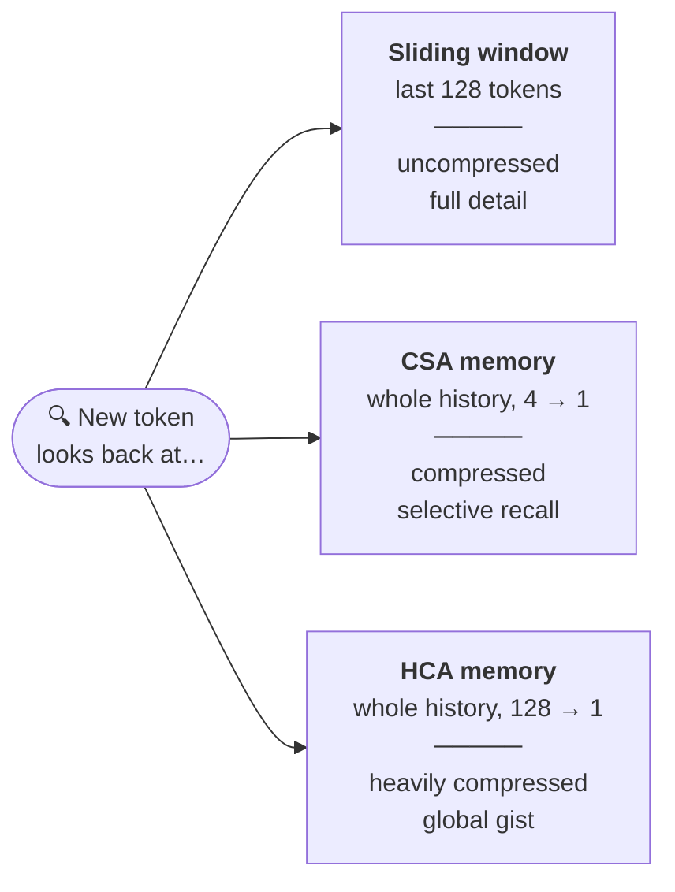
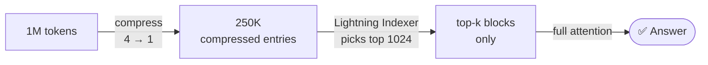
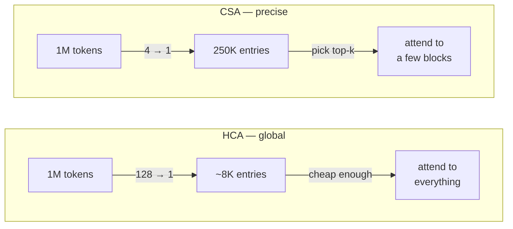

DeepSeek V4 Pro: **$0.04**. Kimi K3: $0.95. Claude Fable 5: **$2.75**.

DeepSeek is **69x cheaper** than Fable.

A big part of the answer is architecture - specifically two hybrid attention mechanisms, CSA and HCA. This article explores how they work, and what makes DeepSeek V4 so cheap.

## Table of Contents
- [Why attention matters](#why-attention-matters)
- [How DeepSeek V4 compresses attention](#how-deepseek-v4-compresses-attention)
- [CSA: compress, then pick what matters](#csa-compress-then-pick-what-matters)
- [HCA: compress harder, look at everything](#hca-compress-harder-look-at-everything)
- [The receipts](#the-receipts)
- [The other half of cheap: MoE](#the-other-half-of-cheap-moe)
- [Other factors](#other-factors)

## Why attention matters

When a transformer generates a token, it looks back at every previous token. Each of those previous tokens sits in memory as a key-value (KV) entry — the KV cache.

Two costs grow with context length:

1. **Memory.** A 1M-token conversation means a KV cache with a million entries, held in memory for every request.
2. **Compute.** Attention cost grows quadratically with context length.

DeepSeek's approach: compress attention using two different techniques.

## How DeepSeek V4 compresses attention

Compression comes from two attention mechanisms: **CSA** and **HCA**. In V4-Pro's 61-layer stack, the first two layers run HCA, layers 2–60 alternate between CSA and HCA, and the multi-token-prediction (MTP) block at the end runs sliding-window attention only. So it's *roughly* a 1:1 interleave - with exceptions at both ends. Both mechanisms keep a sliding-window branch over the most recent tokens, so the newest context is never compressed.

## CSA: compress, then pick what matters

**Compressed Sparse Attention** is the mid-range memory, and it does two things.

**First, compression.** Every 4 consecutive tokens get merged into a single KV entry via softmax-gated pooling with a learned positional bias — the model learns *how* to summarize each group of four, rather than just averaging them. The cache shrinks 4x.

**Second, sparse retrieval.** Even a 4x-smaller cache is too big to attend over densely at 1M tokens. So a lightweight module called the **Lightning Indexer** scans the compressed entries, scores their relevance to the current query, and picks only the most relevant compressed blocks — top-k, with k = 1024 in V4-Pro. 

So CSA is compression *and* sparsity: the memory is 4x smaller, and the model only touches the slice of it that matters right now.

## HCA: compress harder, look at everything

**Heavily Compressed Attention** makes the opposite. Instead of 4 tokens per entry, it packs **128 tokens into one** - a cache 32x lighter than CSA's.

At that size, DeepSeek doesn't bother with sparse selection. The compressed cache is small enough that the model attends densely over **all** of it — no indexer, nothing skipped.

The two mechanisms are complementary:

| | CSA | HCA |
|---|---|---|
| Compression | 4 → 1 | 128 → 1 |
| Attention | Sparse (top-k blocks) | Dense (everything) |
| Character | Precise, selective | Cheap, global |
| Failure mode | Indexer misses a block | Detail lost in summary |

## The receipts

The paper's numbers, at 1M-token context versus DeepSeek's own V3.2:

- **V4-Pro: 27% of the inference FLOPs, 10% of the KV cache.**
- **V4-Flash: 10% of the FLOPs, 7% of the KV cache.**

There are smaller optimizations stacked on top — most KV entries are stored in FP8 (with BF16 reserved for the RoPE dimensions), and the Lightning Indexer runs in FP4 throughout.

## The other half of cheap: MoE

Attention is only part of the cost story. V4-Pro is a Mixture-of-Experts model with **1.6T total parameters but only 49B activated per token** — roughly 3% of the network fires on any forward pass. V4-Flash is 284B total, 13B active.

## Other factors

Beyond that, DeepSeek benefits from cheaper electricity, labor, chips and state backing.

---

*Sources: [DeepSeek-V4: Towards Highly Efficient Million-Token Context Intelligence](https://arxiv.org/abs/2606.19348) · [Sebastian Raschka's CSA/HCA architecture notes](https://sebastianraschka.com/llm-architecture-gallery/csa-hca/) · [Hugging Face: DeepSeek-V4 deep dive](https://huggingface.co/blog/deepseekv4) · [Artificial Analysis: DeepSeek V4 Pro](https://artificialanalysis.ai/models/deepseek-v4-pro)*